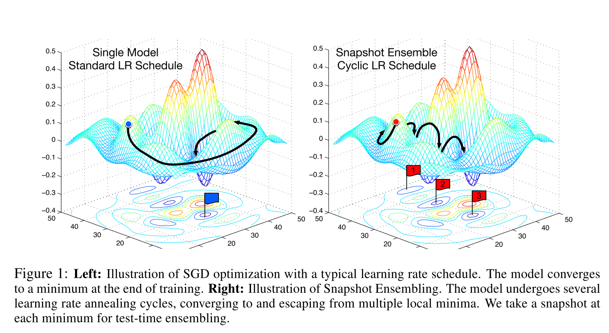

# Neural Network Snapshot Ensembles

This is a partial implementation and demo of concepts explained in paper

`Snapshot Ensembles: Train 1, get M for free`

Gao Huang, Yixuan Li, Geoff Pleiss Cornell University
Zhuang Liu Tsinghua University
John E. Hopcroft, Kilian Q. Weinberger Cornell University

https://arxiv.org/abs/1704.00109 - 2017

> Ensembles of neural networks are known to be much more robust and accurate than individual networks. However, training multiple deep networks for model averaging is computationally expensive. In this paper, we propose a method to obtain the seemingly contradictory goal of ensembling multiple neural networks at no additional training cost. We achieve this goal by training a single neural network, converging to several local minima along its optimization path and saving the model parameters. To obtain repeated rapid convergence, we leverage recent work on cyclic learning rate schedules. The resulting technique, which we refer to as Snapshot Ensembling, is simple, yet surprisingly effective. We show in a series of experiments that our approach is compatible with diverse network architectures and learning tasks. It consistently yields lower error rates than state-of-the-art single models at no additional training cost, and compares favorably with traditional network ensembles. On CIFAR-10 and CIFAR-100 our DenseNet Snapshot Ensembles obtain error rates of 3.4% and 17.4% respectively.
   
In deep learning competitions, it happens quite often that winners use ensemble techniques to build several models using different learning initializations or scheduler to build several models that are mixed together. This technique is efficient as it allows to reach different local minima in the optimization path covering more cases and thus reducing error rates. But it is crazy expensive in terms of resources and time (n ensembles mean n trainings). This is exactly not the way I want that we solve those issues.

Snapshot ensemble idea is to build an ensemble of networks by reaching multiple local minima in a single training. This is achieved by using a cyclic learning rate scheduler that:

- divides the whole training process ($T$ iterations) into several cycles ($M$)
- during each cycle, fast reduces learning rate from initial value at every iteration (in the paper, at batch level, not epoch) to lead optimizer to a local minimum
- hard-reset learning rate at end of cycle back to initial value (or with a progressive decrease) to let optimizer _escape local bath_ and find another local minimum.

At the end of training, we keep the best models found in the last 2 or 3 cycles making our snapshot ensemble of models that should cover more error cases than single best model.

Let's test that idea...

> This code is licensed under Apache2

You can see a better preview of notebook on nbviewer (github doesn't manage plotly plots & other stuff):

https://nbviewer.jupyter.org/github/mandubian/snapshot_ensembles/blob/master/snapshot_ensembles.ipynb
